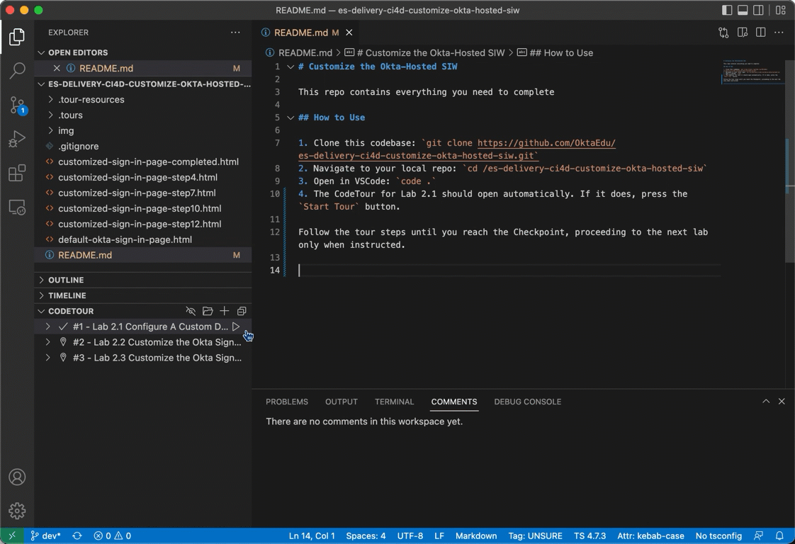

# Customize the Okta-Hosted SIW

This repo contains everything you need to complete 

## How to Use

1. Clone this codebase: 
```
git clone https://github.com/OktaEdu/es-delivery-ci4d-customize-okta-hosted-siw.git
```
2. Navigate to your local repo: 
```
cd /es-delivery-ci4d-customize-okta-hosted-siw
```
3. Open in VSCode: 
```
code .
```
4. The CodeTour for Lab 2.1 should open automatically. If it does, press the `Start Tour` button. 



Follow the tour steps until you reach the Checkpoint, proceeding to the next lab only when instructed.


