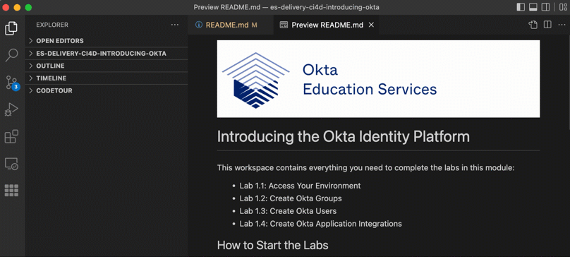

# Customize the Sign-In Page with the Okta-Hosted Sign-In Widget (Redirect Model)

This repo contains everything you need to complete the labs in this module.

- Lab 2.1 Configure a Custom Domain
- Lab 2.2 Customize the Okta Sign-In Page with the Branding UI 
- Lab 2.3 Customize the Okta Sign-In Page with the Sign-In Page Code Editor

## How to Use

1. Clone this codebase: 
```
git clone https://github.com/OktaEdu/es-delivery-ci4d-customize-okta-hosted-siw.git
```
2. Navigate to your local repo: 
```
cd /es-delivery-ci4d-customize-okta-hosted-siw
```
3. Open in VSCode: 
```
code .
```
4. The CodeTour for Lab 2.1 should open automatically. If it doesn't, press the `Start Tour` button. 



Follow the tour steps until you reach the Checkpoint, proceeding to the next lab only when instructed.


